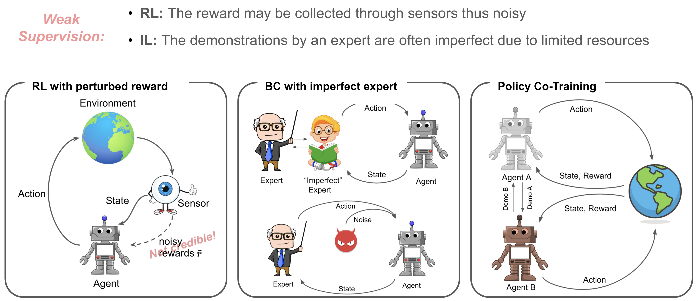

# Policy Learning Using Weak Supervision

[[`Paper`](https://arxiv.org/pdf/2010.01748.pdf)]
[[`arXiv`](https://arxiv.org/abs/2010.01748)]
[[`Project Page`](http://www.cs.toronto.edu/~wangjk/publications/peerpl.html)]

> [Policy Learning Using Weak Supervision]()  
> Jingkang Wang, Hongyi Guo, Zhaowei Zhu, Yang Liu \
> NeurIPS 2021  

<div align="center">
    <br>
    Weak supervision signals are everywhere! We provide a unified formulation of the weakly supervised policy learning problems. We also propose PeerPL, a new way to perform policy evaluation for RL/BC tasks under weak supervision.
</div>

## Reproduce the Results 
TBD

## Citation
If you find our code or paper useful, please consider citing
```bibtex
@inproceedings{wang2021policy,
    title={Policy Learning Using Weak Supervision},
    author={Wang, Jingkang and Guo, Hongyi and Zhu, Zhaowei  and Liu, Yang},
    booktitle={Advances in Neural Information Processing Systems (NeurIPS)},
    year={2021}
}
```

## Questions/Bugs
Please submit a Github issue or contact wangjk@cs.toronto.edu and hongyiguo2025@u.northwestern.edu if you have any questions or find any bugs.